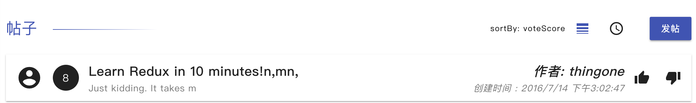
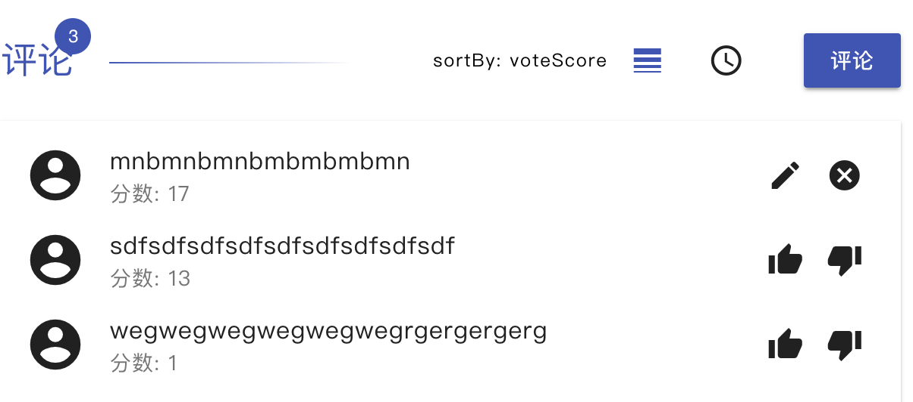

# My react project
优达学城 project stage3

## To start

To get started developing right away:

* install all project dependencies with `npm install` or `yarn install`
* start the development server with `npm start` or `yarn start`


```
src
├── actions
│   └── index.js              所有的动作
├── components                组件
│   ├── App.js                Root
│   ├── directive             小组件(取名糟糕😰)
│   │   ├── Comments.js       评论列表
│   │   ├── Post.js           帖子详情
│   │   ├── Posts.js          帖子列表
│   │   └── PreLoading.js     Loading
│   └── index.js              集合
├── containers                页面
│   ├── AppContainer.js
│   └── index.js
├── index.css
├── index.js                  入口 
├── logo.min.svg
├── reducers
│   └── index.js              动作处理
├── registerServiceWorker.js
├── store.js                  数据仓库
└── util
    ├── api.js                服务端口
    └── constant.js           动作名
```

> 使用 package:

 - material-ui            [👌]
 - material-ui-icons      [👌]
 - react-icons            [没用上]
 - redux-actions          [👌]
 - redux-logger           [👌]
 - redux-thunk            [👌]
 - rmwc                   [╮(╯﹏╰)╭]
 
> 后续考虑增加...
 - props-type
 - jsdoc
---
 > 项目逻辑

 App -

简单的用户登录 - [thingone, thingtwo]

category 选中

 - / => posts.filter(!delete) [Posts]
 - /:category => posts.filter(!delete).filter(category) [Posts]
 - /:category/:post_id => posts.fiter(post.id === postId) [Post][Comments]

---
Posts - 

index.css#68行 投票样式细节

.mdc-list-item__end-detail.item-ctrls



 - posts.map()
 - sortBy()
 - vote()
 - toDetail

---

Post - 

 - getComments(postId)
 - [Comments]
 - vote()
 - delete()
 - edit()
 - reset()

---

Comments - 



 - delete()
 - edit()
 - reset()
 - vote()

 action, reducer -

 [setPosts,setCategorys, setComments]